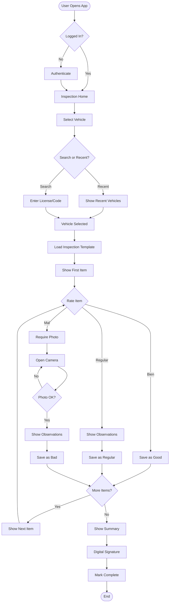

# Product Requirements Document
## Vehicle Inspection Mobile Addon for Odoo v16 Community Edition

**Document Version:** 1.0  
**Date:** January 2025  
**Project Name:** Fleet Vehicle Inspection Mobile  
**Module Technical Name:** `fleet_inspection_mobile`

---

## 1. Executive Summary

### 1.1 Purpose
Develop a mobile-optimized Odoo addon that replaces paper-based vehicle inspection forms with a digital, user-friendly interface. The addon will integrate with Odoo's existing Fleet module to streamline daily vehicle inspections for 10 employees.

### 1.2 Problem Statement
Current OCA Fleet inspection addons are "extremely clunky and unintuitive on mobile," making the inspection process frustrating and time-consuming. Employees need a fast, intuitive way to complete vehicle inspections from their mobile devices.

### 1.3 Solution Overview
A custom Odoo v16 addon featuring a mobile-first, single-item-at-a-time interface that guides users through vehicle inspections with minimal friction, automatic camera integration for damage documentation, and seamless Fleet module integration.

---

## 2. Business Requirements

### 2.1 Primary Objectives
- **Reduce inspection time** from 10+ minutes to under 3 minutes per vehicle
- **Eliminate paper forms** completely 
- **Ensure 100% photo documentation** for all reported issues
- **Provide real-time visibility** of vehicle status to management

### 2.2 Success Metrics
- Average completion time per inspection: < 3 minutes
- User satisfaction score: > 4.5/5
- Photo attachment rate for "Mal" items: 100%
- Daily completion rate: 100% of assigned vehicles

### 2.3 User Personas
**Primary User:** Field Employee
- Age: 25-50
- Technical skill: Low to medium
- Device: Personal or company smartphone (Android/iOS)
- Context: Standing next to vehicle, possibly wearing gloves, in various lighting conditions
- Needs: Quick completion, minimal typing, clear navigation

---

## 3. Functional Requirements

### 3.1 Core Features

#### 3.1.1 Vehicle Selection
- **Quick Search:** Search vehicles by license plate, internal code, or model
- **Recent Vehicles:** Show last 5 inspected vehicles for quick access
- **Visual Identification:** Display vehicle photo, color, and key identifiers
- **Smart Sorting:** Prioritize vehicles due for inspection

#### 3.1.2 Inspection Form Structure

Based on the provided inspection checklist, the form contains these sections:

**SISTEMA ELÉCTRICO**
- Luces altas y bajas
- Luces de posición y giro
- Luces de freno y retroceso
- Balizas Intermitentes
- Alarma acústica de retroceso
- Luces de tablero instrumentos
- Bocina

**CARROCERÍA Y CHASIS**
- Chapa y pintura
- Parabrisas, limpia parabrisas, cristales y espejos
- Paragolpe trasero / delantero
- Puertas y seguros
- Freno de estacionamiento

**INTERIOR**
- Instrumental
- Levantavidrios, cerraduras
- Calefactor / Desempañador
- Aire acondicionado
- Apoyacabezas
- Funcionamiento equipo de radio Am/Fm
- Tacógrafo

**ELEMENTOS DE SEGURIDAD**
- Cinturones de seguridad
- Matafuegos
- Balizas triángulo
- Barra remolque
- Botiquín
- Arrestallamas

**TREN RODANTE**
- Cubiertas, llantas y bulones
- Presión de los neumáticos
- Rueda/s de auxilio
- Alineación y balanceo
- Llave de ruedas y gato

**LIMPIEZA**
- General cleanliness assessment

#### 3.1.3 Item Evaluation Interface

For each inspection item:
- **Rating Options:** 
  - ✅ Bien (Good) - Green button
  - ⚠️ Regular (Fair) - Yellow button  
  - ❌ Mal (Bad) - Red button
- **Observations Field:** Optional text area (hidden by default, expands on tap)
- **Photo Requirement:** 
  - Automatically triggered when "Mal" is selected
  - Optional for "Regular"
  - Not available for "Bien"

#### 3.1.4 Progressive Inspection Flow
- **One Item at a Time:** Full-screen display of current item
- **Progress Indicator:** Visual progress bar showing completion percentage
- **Smart Navigation:**
  - Swipe right or tap "Next" to proceed
  - Swipe left or tap "Back" to review
  - Skip to section via dropdown menu
- **Auto-save:** Every response saved immediately
- **Resume Capability:** Return to last incomplete item if interrupted

#### 3.1.5 Photo Capture
- **Native Camera Integration:** Direct camera access without file picker
- **Photo Annotation:** 
  - Draw circles/arrows on photos
  - Add text labels
  - Highlight problem areas
- **Multiple Photos:** Allow multiple photos per item if needed
- **Automatic Metadata:** GPS location, timestamp, item reference

#### 3.1.6 Driver Information
- **Pre-fill from User:** Auto-populate driver name and license from logged-in user
- **Defensive Driving Course:** Toggle field with expiration date
- **Digital Signature:** Finger-drawn signature at inspection end

### 3.2 Additional Features

#### 3.2.1 Offline Capability
- **Local Storage:** Cache current inspection locally
- **Queue System:** Store completed inspections when offline
- **Auto-sync:** Upload when connection restored
- **Conflict Resolution:** Handle simultaneous inspections of same vehicle

#### 3.2.2 Quick Actions
- **Copy Previous Inspection:** Pre-fill with last inspection values
- **Mark All Good:** Quick button for sections with no issues
- **Voice Notes:** Audio recording option instead of typing
- **Template System:** Predefined issue descriptions

#### 3.2.3 Reporting & Analytics
- **Inspection History:** View past inspections for vehicle
- **Issue Trends:** Track recurring problems
- **Driver Performance:** Inspection completion metrics
- **Fleet Health Dashboard:** Overview of fleet status

---

## 4. Technical Requirements

### 4.1 Architecture

#### 4.1.1 Module Structure
```
fleet_inspection_mobile/
├── __init__.py
├── __manifest__.py
├── models/
│   ├── __init__.py
│   ├── fleet_vehicle.py          # Extend fleet.vehicle
│   ├── inspection.py              # Main inspection model
│   ├── inspection_item.py         # Individual checklist items
│   └── inspection_template.py     # Configurable templates
├── views/
│   ├── inspection_views.xml       # Backend views
│   ├── inspection_mobile.xml      # Mobile-specific views
│   └── menu.xml                   # Menu items
├── static/
│   ├── src/
│   │   ├── js/
│   │   │   ├── inspection_controller.js
│   │   │   ├── inspection_renderer.js
│   │   │   ├── inspection_model.js
│   │   │   ├── components/
│   │   │   │   ├── item_card.js
│   │   │   │   ├── photo_capture.js
│   │   │   │   ├── progress_bar.js
│   │   │   │   └── signature_pad.js
│   │   │   └── utils/
│   │   │       ├── camera.js
│   │   │       └── storage.js
│   │   ├── xml/
│   │   │   ├── inspection_templates.xml
│   │   │   └── components/
│   │   └── scss/
│   │       ├── inspection_mobile.scss
│   │       └── _variables.scss
│   └── img/
├── data/
│   ├── inspection_template_data.xml
│   └── inspection_items_data.xml
├── security/
│   ├── ir.model.access.csv
│   └── inspection_security.xml
└── i18n/
    └── es_AR.po
```

#### 4.1.2 Data Models

**fleet.inspection**
```python
class FleetInspection(models.Model):
    _name = 'fleet.inspection'
    _description = 'Vehicle Inspection'
    _order = 'inspection_date desc'
    
    name = fields.Char(compute='_compute_name', store=True)
    vehicle_id = fields.Many2one('fleet.vehicle', required=True, ondelete='cascade')
    driver_id = fields.Many2one('res.partner', required=True)
    inspection_date = fields.Datetime(default=fields.Datetime.now)
    odometer = fields.Float('Odometer')
    state = fields.Selection([
        ('draft', 'In Progress'),
        ('completed', 'Completed'),
        ('cancelled', 'Cancelled')
    ], default='draft')
    
    # Driver info
    license_number = fields.Char('License Number')
    license_type = fields.Char('License Type')
    license_expiry = fields.Date('License Expiry')
    defensive_course = fields.Boolean('Defensive Driving Course')
    course_duration = fields.Char('Course Duration')
    
    # Insurance info
    insurance_policy = fields.Char('Insurance Policy')
    insurance_expiry = fields.Date('Insurance Expiry')
    
    # Inspection items
    inspection_line_ids = fields.One2many('fleet.inspection.line', 'inspection_id')
    
    # Summary fields
    items_good = fields.Integer(compute='_compute_summary')
    items_regular = fields.Integer(compute='_compute_summary')
    items_bad = fields.Integer(compute='_compute_summary')
    overall_status = fields.Selection([
        ('good', 'Good - Ready to Use'),
        ('attention', 'Attention Required'),
        ('maintenance', 'Requires Maintenance')
    ], compute='_compute_overall_status')
    
    # Signature
    driver_signature = fields.Binary('Driver Signature')
    supervisor_signature = fields.Binary('Supervisor Signature')
    
    observations = fields.Text('General Observations')
    
    # Metadata
    completion_time = fields.Float('Completion Time (minutes)', compute='_compute_completion_time')
    device_info = fields.Char('Device Info')  # Store mobile device details
```

**fleet.inspection.line**
```python
class FleetInspectionLine(models.Model):
    _name = 'fleet.inspection.line'
    _description = 'Inspection Checklist Item'
    _order = 'sequence, id'
    
    inspection_id = fields.Many2one('fleet.inspection', required=True, ondelete='cascade')
    template_item_id = fields.Many2one('fleet.inspection.template.item', required=True)
    
    # Item info from template
    name = fields.Char(related='template_item_id.name')
    section = fields.Char(related='template_item_id.section_id.name')
    sequence = fields.Integer(related='template_item_id.sequence')
    
    # Inspection result
    status = fields.Selection([
        ('bien', 'Bien'),
        ('regular', 'Regular'),
        ('mal', 'Mal'),
        ('na', 'N/A')
    ], required=True)
    
    observations = fields.Text('Observations')
    
    # Photos
    photo_ids = fields.One2many('fleet.inspection.photo', 'line_id')
    photo_required = fields.Boolean(compute='_compute_photo_required')
    
    # Timestamps
    inspected_at = fields.Datetime('Inspected At')
    time_spent = fields.Float('Time Spent (seconds)')
```

### 4.2 Frontend Implementation

#### 4.2.1 Custom View Type
```javascript
/** @odoo-module */
import { registry } from "@web/core/registry";
import { Layout } from "@web/search/layout";
import { Component, useState, onWillStart } from "@odoo/owl";

export class InspectionMobileController extends Component {
    static template = "fleet_inspection_mobile.Controller";
    static components = { Layout };
    
    setup() {
        this.state = useState({
            currentItemIndex: 0,
            totalItems: 0,
            isPhotoMode: false,
            inspection: null
        });
        
        // Device detection
        this.isMobile = /iPhone|iPad|iPod|Android/i.test(navigator.userAgent);
        
        // Initialize camera permissions
        this.initializeCamera();
        
        // Auto-save timer
        this.autoSaveInterval = setInterval(() => this.autoSave(), 5000);
    }
}

export const inspectionMobileView = {
    type: "inspection_mobile",
    display_name: "Vehicle Inspection",
    icon: "fa-car",
    multiRecord: false,
    Controller: InspectionMobileController,
    Renderer: InspectionMobileRenderer,
    Model: InspectionMobileModel,
    
    props: {
        resModel: { type: String, optional: true },
        domain: { type: Array, optional: true },
        context: { type: Object, optional: true }
    }
};

registry.category("views").add("inspection_mobile", inspectionMobileView);
```

#### 4.2.2 Mobile-Optimized Components

**Item Card Component**
```javascript
export class InspectionItemCard extends Component {
    static template = xml`
        <div class="inspection-item-card">
            <div class="item-header">
                <span class="section-name" t-esc="props.section"/>
                <span class="item-number">
                    <t t-esc="props.currentIndex + 1"/> / <t t-esc="props.totalItems"/>
                </span>
            </div>
            
            <h2 class="item-title" t-esc="props.item.name"/>
            
            <div class="status-buttons">
                <button class="btn-status btn-good" 
                        t-att-class="{'active': state.status === 'bien'}"
                        t-on-click="() => this.setStatus('bien')">
                    <i class="fa fa-check-circle"/> BIEN
                </button>
                <button class="btn-status btn-regular"
                        t-att-class="{'active': state.status === 'regular'}"
                        t-on-click="() => this.setStatus('regular')">
                    <i class="fa fa-exclamation-triangle"/> REGULAR
                </button>
                <button class="btn-status btn-bad"
                        t-att-class="{'active': state.status === 'mal'}"
                        t-on-click="() => this.setStatus('mal')">
                    <i class="fa fa-times-circle"/> MAL
                </button>
            </div>
            
            <div class="observations-section" 
                 t-att-class="{'expanded': state.showObservations}">
                <button class="btn-toggle-observations"
                        t-on-click="toggleObservations">
                    <i class="fa fa-comment"/> Agregar observación
                </button>
                <textarea t-if="state.showObservations"
                          class="form-control observations-field"
                          placeholder="Escriba sus observaciones aquí..."
                          t-model="state.observations"/>
            </div>
            
            <div class="photo-section" t-if="state.status === 'mal'">
                <div class="photo-required-alert">
                    <i class="fa fa-camera"/> Foto requerida para items marcados como MAL
                </div>
                <PhotoCapture 
                    photos="state.photos"
                    onPhotoTaken="(photo) => this.addPhoto(photo)"
                    maxPhotos="3"/>
            </div>
        </div>
    `;
}
```

### 4.3 Mobile UI/UX Specifications

#### 4.3.1 Design System

**Color Palette**
```scss
$color-good: #28a745;      // Green for "Bien"
$color-regular: #ffc107;   // Yellow for "Regular"
$color-bad: #dc3545;       // Red for "Mal"
$color-primary: #2c3e50;   // Primary brand color
$color-background: #f8f9fa;
$color-text: #212529;
$color-muted: #6c757d;
```

**Typography**
```scss
// Minimum sizes for mobile readability
$font-size-title: 24px;
$font-size-body: 16px;     // Prevents iOS zoom
$font-size-button: 18px;
$font-size-small: 14px;

// Touch targets
$min-touch-target: 48px;    // Google Material Design recommendation
$button-padding: 16px 24px;
$spacing-unit: 8px;
```

#### 4.3.2 Screen Layouts

**Vehicle Selection Screen**
```
┌─────────────────────────────┐
│ ← Inspecciones   [+Nueva]   │ Header
├─────────────────────────────┤
│ 🔍 Buscar vehículo...       │ Search
├─────────────────────────────┤
│ RECIENTES                   │
│ ┌───────────────────────┐   │
│ │ 🚗 Toyota Hilux       │   │ Recent
│ │ ABC-123 | Últ: Ayer   │   │ Vehicles
│ └───────────────────────┘   │
│ ┌───────────────────────┐   │
│ │ 🚐 Ford Transit       │   │
│ │ DEF-456 | Últ: Hoy    │   │
│ └───────────────────────┘   │
├─────────────────────────────┤
│ TODOS LOS VEHÍCULOS         │
│ [Lista de vehículos...]     │
└─────────────────────────────┘
```

**Inspection Item Screen**
```
┌─────────────────────────────┐
│ [=========>      ] 45%      │ Progress
├─────────────────────────────┤
│ SISTEMA ELÉCTRICO     2/7   │ Section
├─────────────────────────────┤
│                             │
│   Luces altas y bajas       │ Item
│                             │ Title
├─────────────────────────────┤
│ ┌───────┐ ┌───────┐ ┌─────┐│
│ │   ✓   │ │   !   │ │  ✗  ││ Status
│ │ BIEN  │ │REGULAR│ │ MAL ││ Buttons
│ └───────┘ └───────┘ └─────┘│
├─────────────────────────────┤
│ 💬 Agregar observación      │ Optional
├─────────────────────────────┤
│ [Anterior]        [Siguiente]│ Navigation
└─────────────────────────────┘
```

**Photo Capture Screen (when MAL selected)**
```
┌─────────────────────────────┐
│ ⚠️ Foto Requerida           │ Alert
├─────────────────────────────┤
│ ┌───────────────────────┐   │
│ │                       │   │
│ │    [Camera View]      │   │ Camera
│ │                       │   │ Preview
│ └───────────────────────┘   │
├─────────────────────────────┤
│ [📷 Tomar Foto]             │ Capture
├─────────────────────────────┤
│ Fotos: [thumb] [thumb] [+]  │ Gallery
└─────────────────────────────┘
```

### 4.4 Integration Requirements

#### 4.4.1 Fleet Module Integration
- Extend `fleet.vehicle` model with inspection history
- Add inspection count and last inspection date to vehicle form
- Create smart button on vehicle form to access inspections
- Integrate with existing maintenance requests when issues found

#### 4.4.2 API Endpoints
```python
# REST API for mobile app (if needed for future native app)
@http.route('/api/inspection/vehicles', type='json', auth='user')
def get_vehicles(self):
    """Return list of vehicles available for inspection"""
    
@http.route('/api/inspection/start', type='json', auth='user')
def start_inspection(self, vehicle_id):
    """Initialize new inspection"""
    
@http.route('/api/inspection/item/update', type='json', auth='user')
def update_item(self, inspection_id, item_id, status, observations=None):
    """Update single inspection item"""
    
@http.route('/api/inspection/photo/upload', type='http', auth='user', csrf=False)
def upload_photo(self, inspection_id, item_id, **kwargs):
    """Handle photo upload with base64 encoding"""
```

### 4.5 Performance Requirements
- Initial load time: < 2 seconds on 4G
- Item transition: < 300ms
- Photo capture to save: < 3 seconds
- Auto-save frequency: Every 5 seconds or on item change
- Maximum photo size: 2MB (compressed client-side)
- Offline data cache: Up to 50MB

---

## 5. User Flow

### 5.1 Primary Flow: Complete Inspection



### 5.2 Alternative Flows

**5.2.1 Resume Incomplete Inspection**
1. User returns to app
2. System detects incomplete inspection
3. Prompt: "Continue previous inspection?"
4. Resume from last incomplete item

**5.2.2 Skip Item**
1. User cannot evaluate item (e.g., equipment not present)
2. Long-press item or swipe up
3. Select "N/A - Not Applicable"
4. Add required explanation

**5.2.3 Bulk Actions**
1. User enters section with all items good
2. Tap "Mark All Good" button
3. Confirm action
4. Skip to next section

---

## 6. Security & Compliance

### 6.1 Access Control
- **Inspection Create:** Fleet User, Fleet Manager
- **Inspection Read:** All authenticated users
- **Inspection Update:** Creator (within 24 hours), Fleet Manager
- **Inspection Delete:** Fleet Manager only
- **Photo View:** Based on inspection read permission

### 6.2 Data Privacy
- Photos stored in Odoo filestore with access control
- GPS data optional (configurable per company)
- Personal data (driver info) encrypted at rest
- Audit trail for all modifications

### 6.3 Compliance Requirements
- Digital signatures legally binding (where applicable)
- Inspection records retained for 5 years
- Export capability for regulatory audits
- Timestamp integrity (server-side validation)

---

## 7. Configuration & Settings

### 7.1 Company-Level Settings
```python
class ResCompany(models.Model):
    _inherit = 'res.company'
    
    # Inspection Configuration
    inspection_require_photo_for_bad = fields.Boolean(default=True)
    inspection_allow_photo_for_regular = fields.Boolean(default=True)
    inspection_max_photos_per_item = fields.Integer(default=3)
    inspection_enable_gps = fields.Boolean(default=False)
    inspection_require_signature = fields.Boolean(default=True)
    inspection_auto_create_maintenance = fields.Boolean(
        string='Auto-create Maintenance Request for Bad Items',
        default=True
    )
    inspection_template_id = fields.Many2one(
        'fleet.inspection.template',
        string='Default Inspection Template'
    )
```

### 7.2 User Preferences
- Preferred inspection view (card/list)
- Auto-advance to next item
- Sound feedback on actions
- High contrast mode
- Text size adjustment

---

## 8. Testing Requirements

### 8.1 Device Testing Matrix
| Device Type | OS Version | Browser | Priority |
|------------|------------|---------|----------|
| iPhone 12+ | iOS 14+ | Safari | High |
| Samsung Galaxy | Android 10+ | Chrome | High |
| iPhone SE | iOS 13+ | Safari | Medium |
| Xiaomi/Huawei | Android 9+ | Chrome | Medium |
| iPad | iOS 14+ | Safari | Low |

### 8.2 Test Scenarios
1. **Happy Path:** Complete inspection with all good items (< 2 min)
2. **Photo Required:** Mark item as bad, take photo, annotate
3. **Offline Mode:** Complete inspection offline, verify sync
4. **Interruption:** Phone call during inspection, resume
5. **Validation:** Try to complete without required photos
6. **Performance:** 50+ items inspection performance
7. **Concurrency:** Two users inspect same vehicle

### 8.3 Acceptance Criteria
- [ ] All buttons minimum 48x48px touch target
- [ ] Text readable without zooming (16px minimum)
- [ ] Camera opens in < 1 second
- [ ] Photos compress to < 2MB automatically
- [ ] Form validates before submission
- [ ] Offline mode works for 24 hours
- [ ] Spanish language fully supported

---

## 9. Deployment Plan

### 9.1 Phase 1: MVP (Week 1-2)
- Basic inspection flow (one item at a time)
- Three status buttons (Bien/Regular/Mal)
- Camera integration for photos
- Vehicle selection from Fleet
- Save to database

### 9.2 Phase 2: Enhanced UX (Week 3)
- Progress indicator
- Swipe navigation
- Auto-save
- Observations field
- Photo annotation

### 9.3 Phase 3: Advanced Features (Week 4)
- Offline capability
- Digital signature
- Templates system
- Bulk actions
- Resume inspection

### 9.4 Phase 4: Analytics (Future)
- Reporting dashboard
- Trend analysis
- Maintenance integration
- Export capabilities

---

## 10. Risk Mitigation

| Risk | Impact | Probability | Mitigation |
|------|--------|-------------|------------|
| Camera API compatibility | High | Medium | Fallback to file input |
| Offline sync conflicts | Medium | Low | Last-write-wins + audit log |
| User adoption resistance | High | Medium | Training videos, champions program |
| Photo storage limits | Medium | Medium | Auto-compression, retention policy |
| Performance on old devices | Medium | Medium | Progressive enhancement, feature detection |

---

## 11. Success Metrics & KPIs

### 11.1 Launch Metrics (First 30 days)
- User adoption rate: > 80%
- Average completion time: < 3 minutes
- Error rate: < 5%
- Support tickets: < 10

### 11.2 Ongoing Metrics
- Daily completion rate: 100%
- Photo attachment rate: 100% for "Mal" items
- User satisfaction: > 4.5/5 stars
- System uptime: 99.9%
- Data sync success rate: > 99%

---

## 12. Appendices

### Appendix A: Inspection Item Master List
[Complete list of all inspection items organized by section, as provided in the original form]

### Appendix B: UI Mockups
[Link to Figma/design files]

### Appendix C: Database Schema
[ERD diagram of all models and relationships]

### Appendix D: API Documentation
[Detailed API specs for future mobile app]

### Appendix E: Localization
- Spanish (Argentina) as primary language
- Date format: DD/MM/YYYY
- Decimal separator: comma
- Thousand separator: period

---

## Document Approval

| Role | Name | Signature | Date |
|------|------|-----------|------|
| Product Owner | | | |
| Technical Lead | | | |
| Fleet Manager | | | |
| End User Representative | | | |